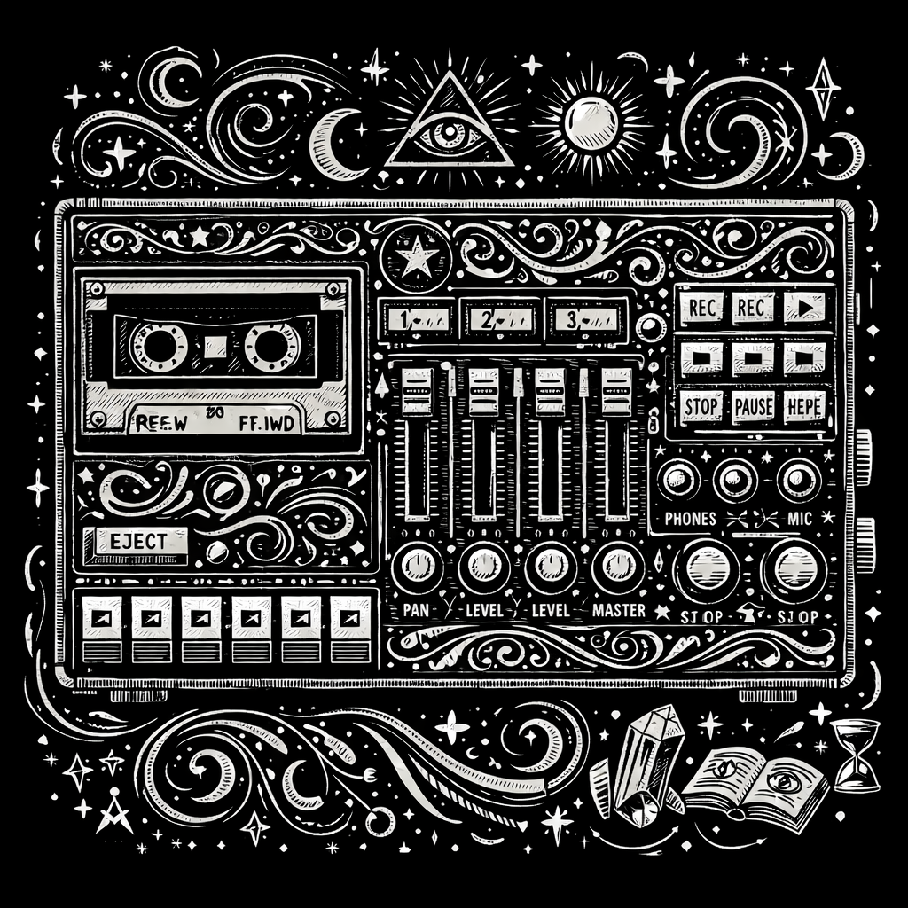

# Arpeggiator Plugin

A [Signals & Sorcery](https://signalsandsorcery.com) plugin for multi-voice arpeggios — describe one pattern and get **a repeating arp cell split across 1–4 voices**, each on its own Surge XT track.

<p align="center">
  
</p>

> Part of the **[Signals & Sorcery](https://signalsandsorcery.com)** ecosystem.

## What it does

- One prompt ("glassy trance arp", "2 voices, skippy 1/16 cascade") designs the arp cell in a **single schema-forced LLM call** — chord-degree steps with rests, octave contour, and velocity accents, not absolute pitches
- **A mechanical expander** (not the LLM) tiles the cell over the scene's bars at the chosen rate (**1/4, 1/8, 1/16**) and re-roots every step on that bar's chord — the output is chord tones by construction and cannot leave the harmony
- **One pattern, split across voices**: **vertical** carves the stream into pitch bands (the `1`s of a 1-3-5-3-1 land on one patch, the `3-5-3` on another); **horizontal** alternates whole bars between patches (bar 1 on voice 1, bar 2 on voice 2, …)
- The voices land as **one voice-group**: the anchor row carries the prompt; the header adds voice-count (1–4), rate, and split controls; any row's Generate regenerates the whole arp
- Each voice's Surge XT preset is chosen mechanically from the `arp` role + its actual register; regeneration reconciles the group and **never replaces a sound you picked**
- Sees the rest of the scene (drums, existing synths) through the shared concurrent-tracks context, so the arp interlocks with the mix instead of talking over it

## The splits

| Split | What each voice gets | Feels like |
|---|---|---|
| vertical | a contiguous pitch band of the cell (top band → bottom band) | one arp played by layered instruments |
| horizontal | every Nth bar of the stream (odd bars / even bars / …) | the arp's timbre rotating bar by bar |

## Install

From within Signals & Sorcery: **Settings > Manage Plugins > Add Plugin** and enter:

```
https://github.com/shiehn/sas-arpeggiator-plugin
```

Or clone manually into `~/.signals-and-sorcery/plugins/@signalsandsorcery/arp-generator/`.

## Capabilities

| Capability | Required |
|------------|----------|
| `requiresLLM` | Yes - arp cell design (schema-forced function calling) |
| `requiresSurgeXT` | Yes - per-voice synth preset loading |

## Dev

```bash
npm install
npm test        # jest — arp-core (parse/expand/split), voice-meta/reconcile, music helpers, the generation brain
npm run build   # tsup → dist (the app consumes dist via file: dep)
```

Requires `@signalsandsorcery/plugin-sdk` ≥ 2.43.0 (panel-core: `GeneratorPanelShell`, group extensions, the Surge sound adapter, and the `onTrackCreated` hook that puts the header controls up before the first generation).
